===============
User interface
===============

.. contents:: Table of Contents

.. _intro:

1. Intro
------------

Intro screen, loaded with all information and ready to start.

.. image:: screens/ios/RBE-Intro.png
   :width: 320px

.. _intro_funds_error:

1.1. Intro - Insufficient Funds
~~~~~~~~~~~~~~~~~~~~~~~~~~~~~~~~~~~

Intro screen, when there are insufficient funds
and screen waits for balance updates.

.. image:: screens/ios/RBE-Intro-FundsError.png
   :width: 320px

1.2. Intro - Loading
~~~~~~~~~~~~~~~~~~~~~~~~~~~~~~~~~~

Intro screen when information is still loading

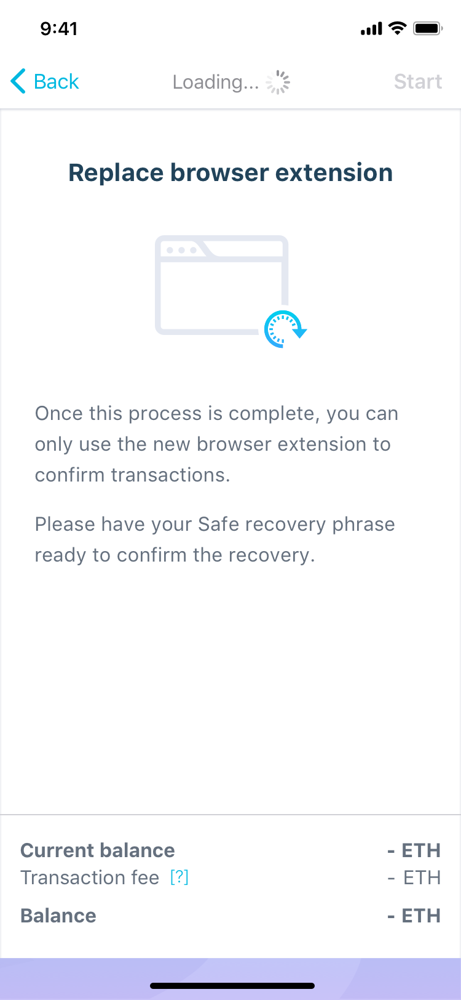

1.3. Intro - Error Alert
~~~~~~~~~~~~~~~~~~~~~~~~~~~~~~~~~~~~~~

Intro screen when "Start" action resulted in alert

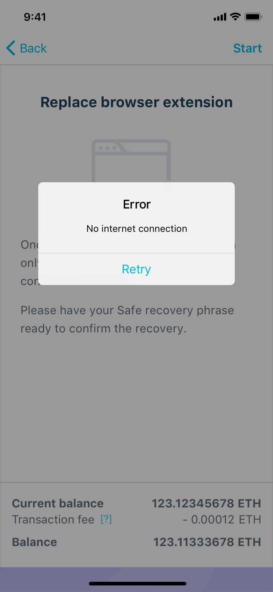

1.4. Intro - Start Action Loading
~~~~~~~~~~~~~~~~~~~~~~~~~~~~~~~~~~~~~~~~~~~~~~~

Intro screen when "Start" action taking long time.

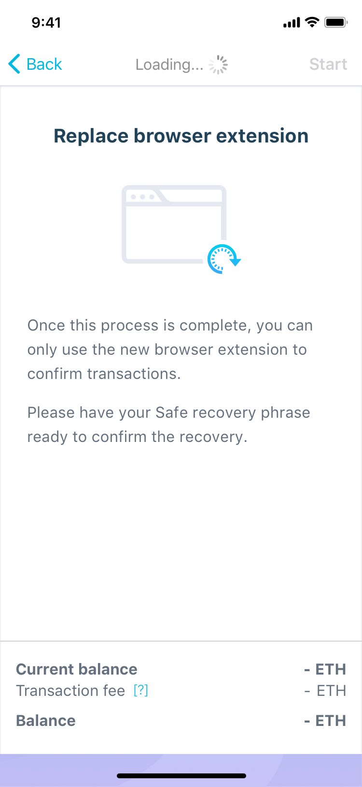

1.5. Intro - Inline Error
~~~~~~~~~~~~~~~~~~~~~~~~~~~~~~~~~~~~~~~

Intro screen showing error when initial loading action failed.

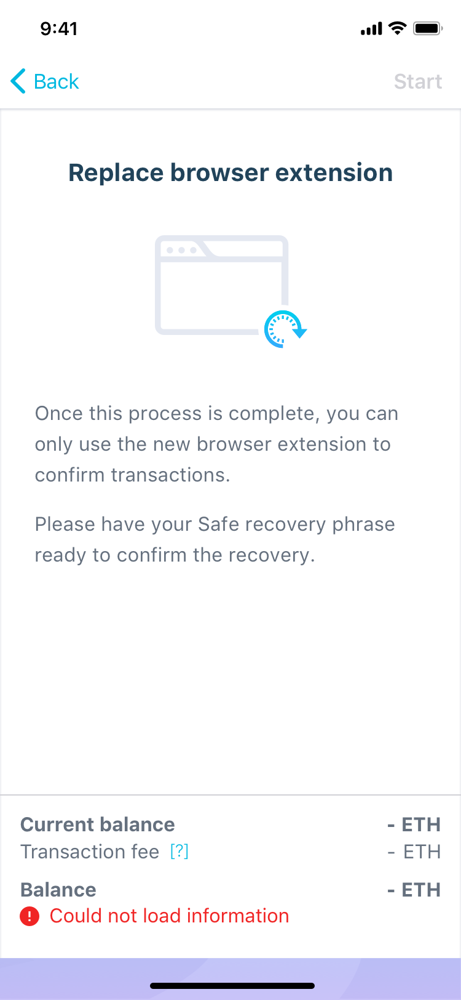

.. _scan:

2. Scan QR Code
---------------

Scan QR Code screen ready to start scanning

.. image:: screens/ios/RBE-Scan.png
   :width: 320px

2.1. Scan QR Code - Loading
~~~~~~~~~~~~~~~~~~~~~~~~~~~~~~~~~~~~~~~~~

Loading under slow operating conditions - after scanning a valid QR code

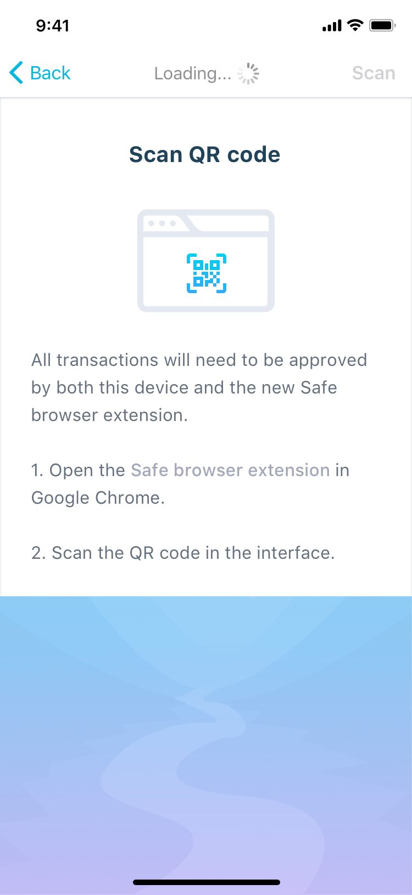

3. Camera screen
---------------------------

Camera screen for scanning a QR code.

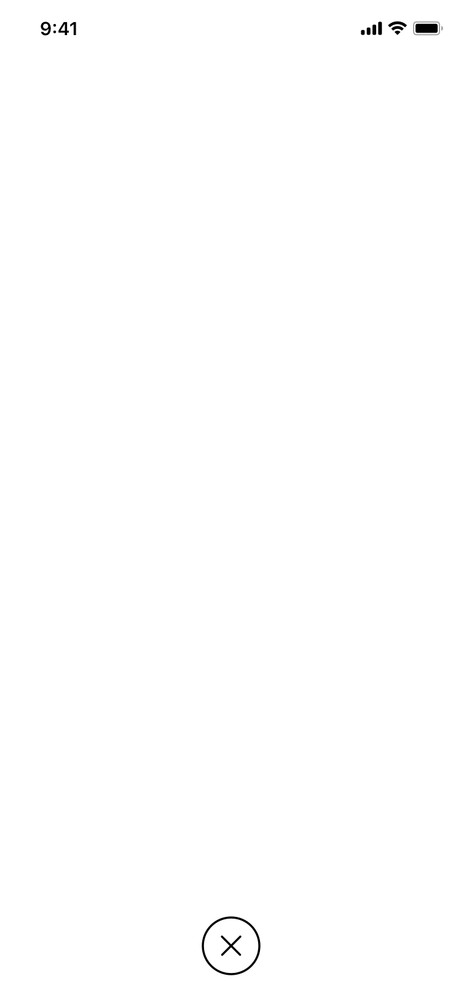

3.1. Camera Screen - Error Alert
~~~~~~~~~~~~~~~~~~~~~~~~~~~~~~~~~~~~~~~~~~~~~~

Error shown after scanning invalid QR-code

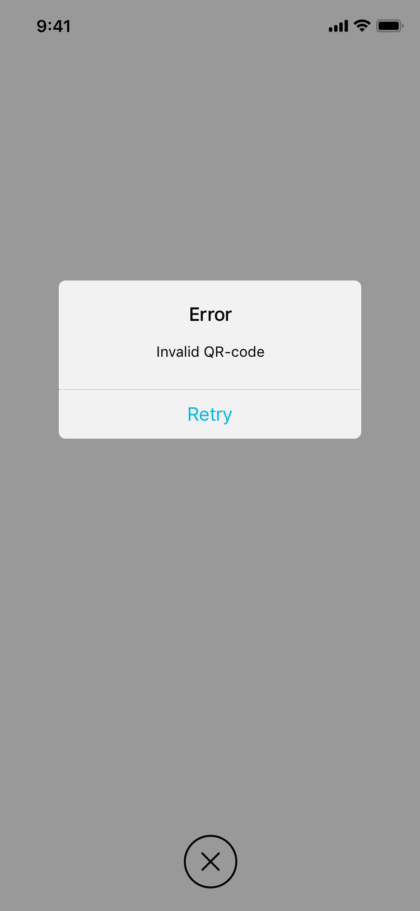

.. _phrase:

4. Recovery Phrase
------------------

Recovery Phrase input screen with inline error related to the recovery phrase

.. image:: screens/ios/RBE-Phrase.png
   :width: 320px

4.1. Recovery Phrase - Loading
~~~~~~~~~~~~~~~~~~~~~~~~~~~~~~~~~~~~~~~~~~~~

Recovery Phrase screen when "Next" action takes long time.

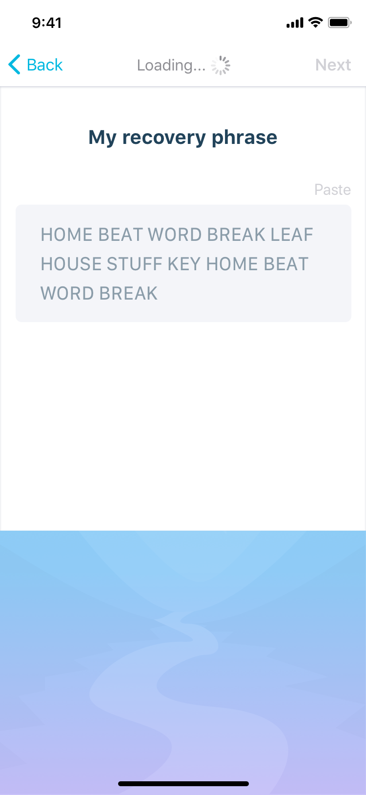

.. _review:

5. Review
-----------------------

Review transaction screen. Similar to RecoverSafe's review

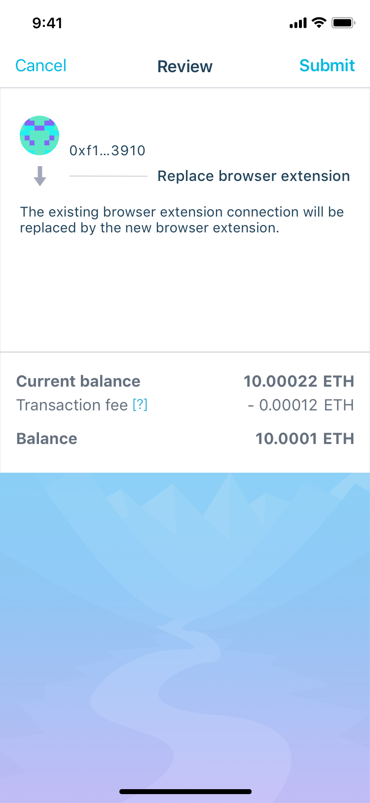

5.1 Review - Loading
~~~~~~~~~~~~~~~~~~~~~~~~~~~~~~~~~~

Review screen after selecting "Submit" action, showing the loading
indicator for the long-running operation.

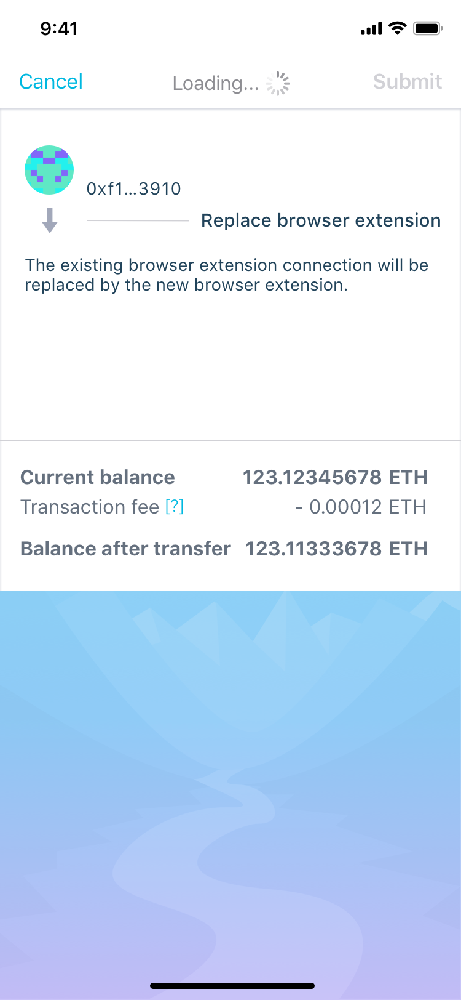

5.2. Review - Error Alert
~~~~~~~~~~~~~~~~~~~~~~~~~~~~~~~~~~~~~~~

Review screen showing error after selecting "Submit" action.

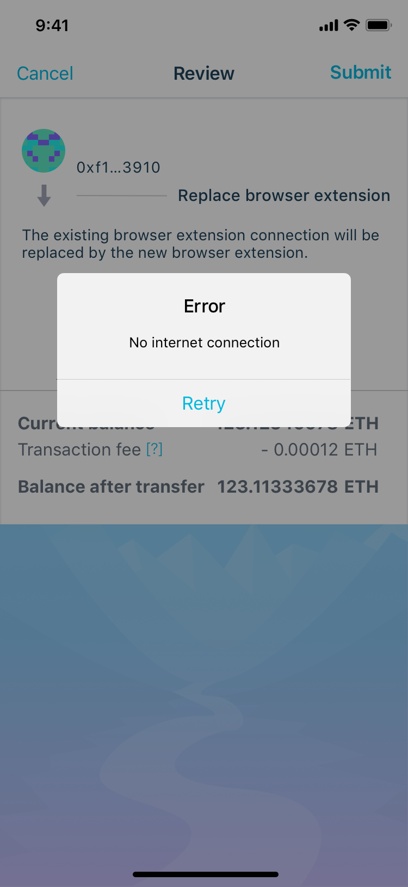

.. _list:

6. Transaction List
---------------------------------

Transaction list showing the "Replace Browser Extension" item in 3 statuses:

* Pending
* Success
* Failed

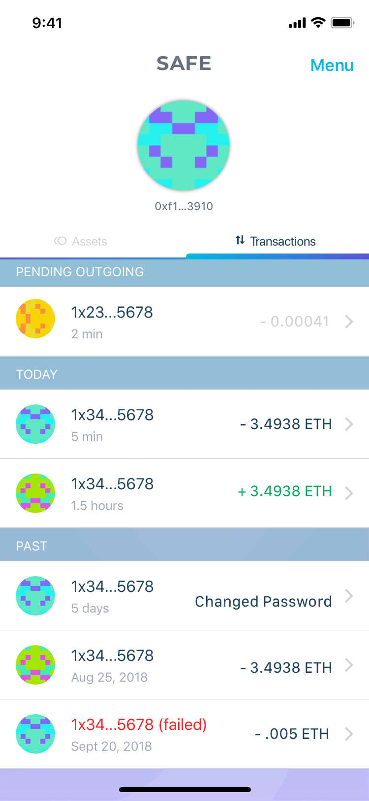

6.1. Pending Transaction
~~~~~~~~~~~~~~~~~~~~~~~~~~~

6.2. Successful Transaction
~~~~~~~~~~~~~~~~~~~~~~~~~~~~~~~~

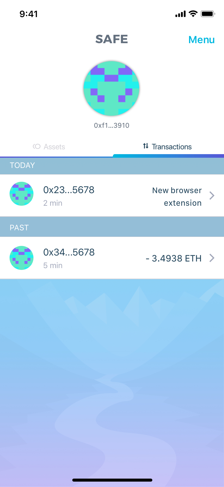

6.3. Failed Transaction
~~~~~~~~~~~~~~~~~~~~~~~~~~

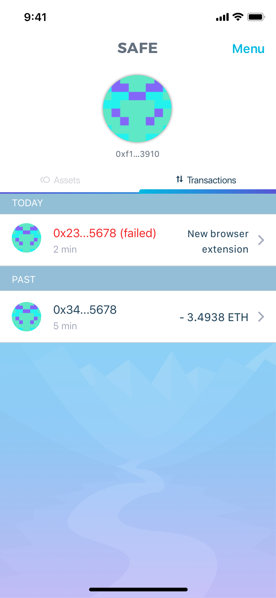

.. _details:

7. Transaction Details
------------------------------------

Transaction Details screen showing "Replace Browser Extension",
possibly in 3 statuses.

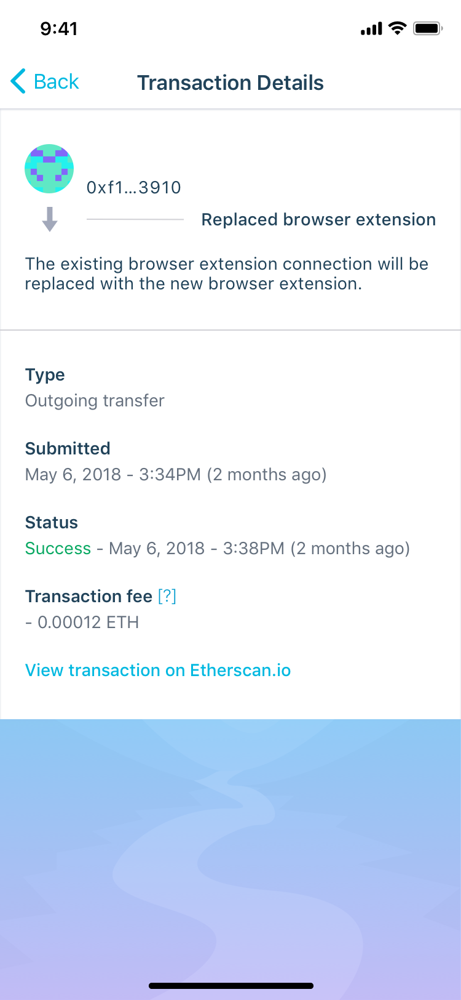

7.1. Pending Transaction
~~~~~~~~~~~~~~~~~~~~~~~~~~~~~~~~~~~~

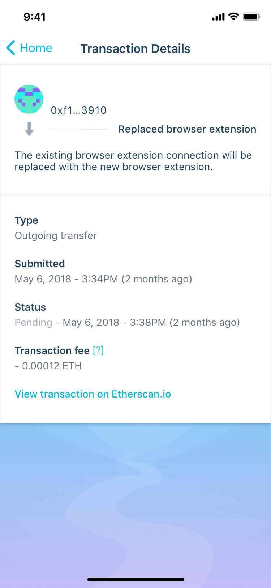

7.2. Successful Transaction
~~~~~~~~~~~~~~~~~~~~~~~~~~~~~

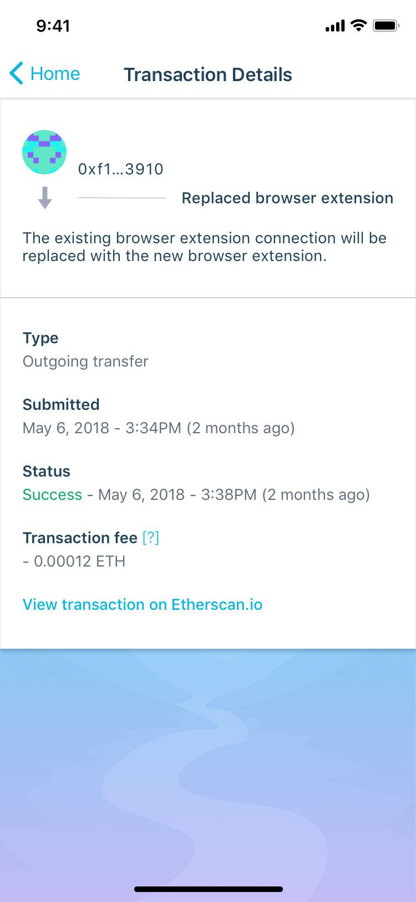

7.3. Failed Transaction
~~~~~~~~~~~~~~~~~~~~~~~~

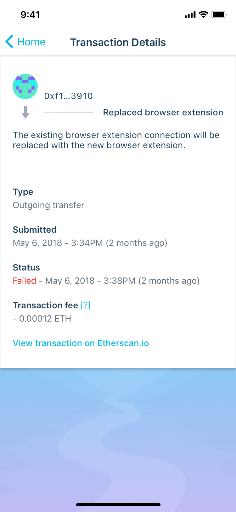
