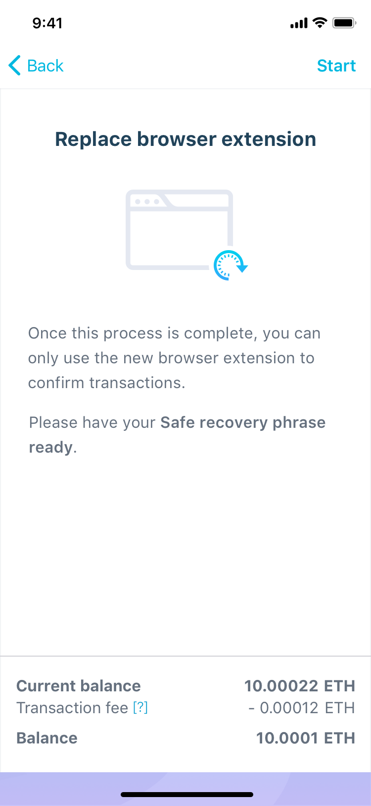
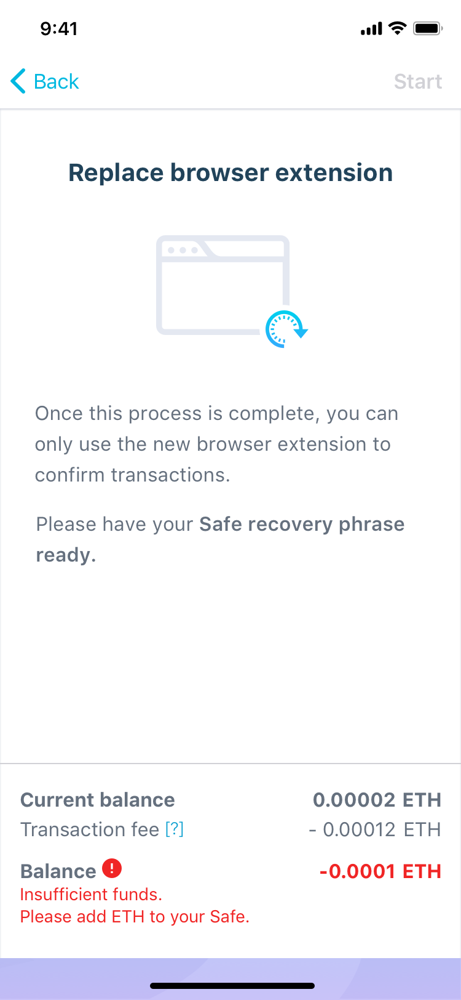
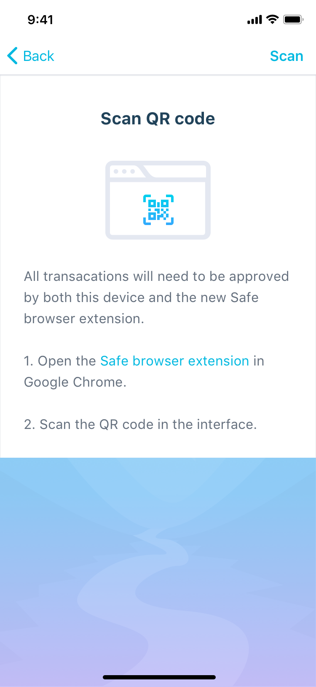
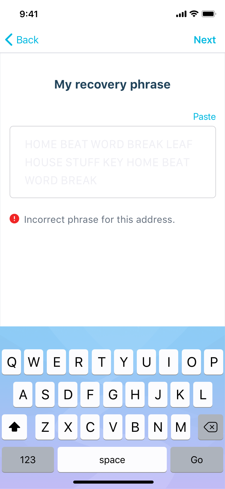
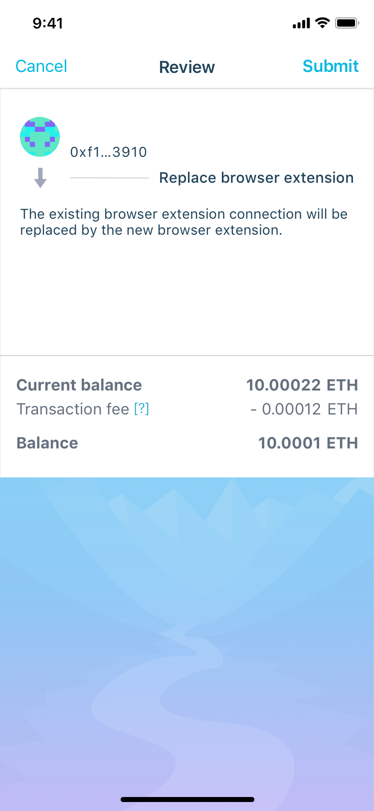
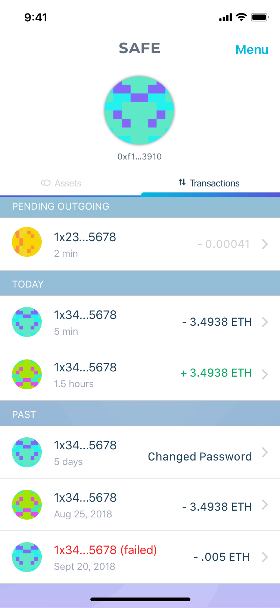
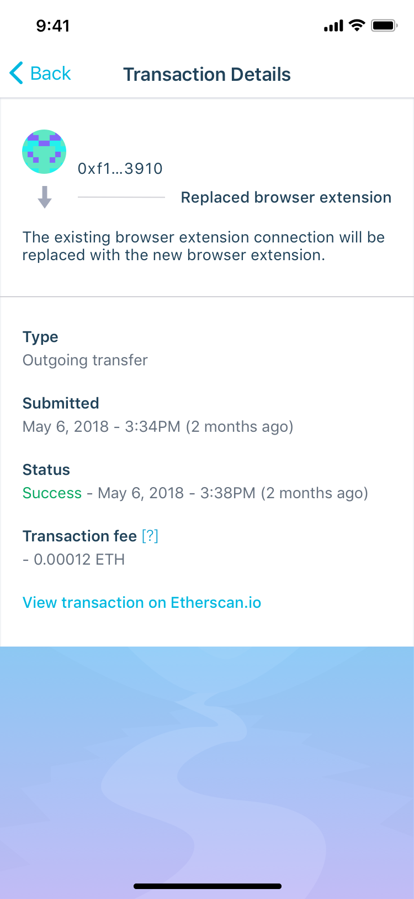

===============
User interface
===============

.. contents:: Table of Contents

1. Intro
------------

Intro screen, loaded with all information and ready to start.

1.1. Intro - Insufficient Funds
~~~~~~~~~~~~~~~~~~~~~~~~~~~~~~~~~~~

Intro screen, when there are insufficient funds
and screen waits for balance updates.

1.2. [missing] Intro - Loading
~~~~~~~~~~~~~~~~~~~~~~~~~~~~~~~~~~

Intro screen when information is still loading

1.3. [missing] Intro - Error Alert
~~~~~~~~~~~~~~~~~~~~~~~~~~~~~~~~~~~~~~

Intro screen when "Start" action resulted in alert

1.4. [missing] Intro - Start Action Loading
~~~~~~~~~~~~~~~~~~~~~~~~~~~~~~~~~~~~~~~~~~~~~~~

Intro screen when "Start" action taking long time.

1.5. [missing] Intro - Inline Error
~~~~~~~~~~~~~~~~~~~~~~~~~~~~~~~~~~~~~~~

Intro screen showing error when initial loading action failed.

2. Scan QR Code
---------------

Scan QR Code screen ready to start scanning

2.1. [missing] Scan QR Code - Loading
~~~~~~~~~~~~~~~~~~~~~~~~~~~~~~~~~~~~~~~~~

Loading under slow operating conditions - after scanning a valid QR code

3. [missing] Camera screen
---------------------------

Camera screen for scanning a QR code.

3.1. [missing] Camera Screen - Error Alert
~~~~~~~~~~~~~~~~~~~~~~~~~~~~~~~~~~~~~~~~~~~~~~

Error shown after scanning invalid QR-code

4. Recovery Phrase
------------------

Recovery Phrase input screen with inline error related to the recovery phrase

4.1. [missing] Recovery Phrase - Loading
~~~~~~~~~~~~~~~~~~~~~~~~~~~~~~~~~~~~~~~~~~~~

Recovery Phrase screen when "Next" action takes long time.

5. Review
-----------------------

Review transaction screen. Similar to RecoverSafe's review

5.1 [missing] Review - Loading
~~~~~~~~~~~~~~~~~~~~~~~~~~~~~~~~~~

Review screen after selecting "Submit" action, showing the loading
indicator for the long-running operation.

5.2. [missing] Review - Error Alert
~~~~~~~~~~~~~~~~~~~~~~~~~~~~~~~~~~~~~~~

Review screen showing error after selecting "Submit" action.

6. Transaction List
---------------------------------

Transaction list showing the "Replace Browser Extension" item in 3 statuses:

* Pending
* Success
* Failed

7. Transaction Details
------------------------------------

Transaction Details screen showing "Replace Browser Extension",
possibly in 3 statuses.

Revision History
----------------

==========  =======================================================
Date        Description
==========  =======================================================
2019-01-07  New document with user interface requirements for the "Replace
            Browser Extension" feature.
==========  =======================================================
