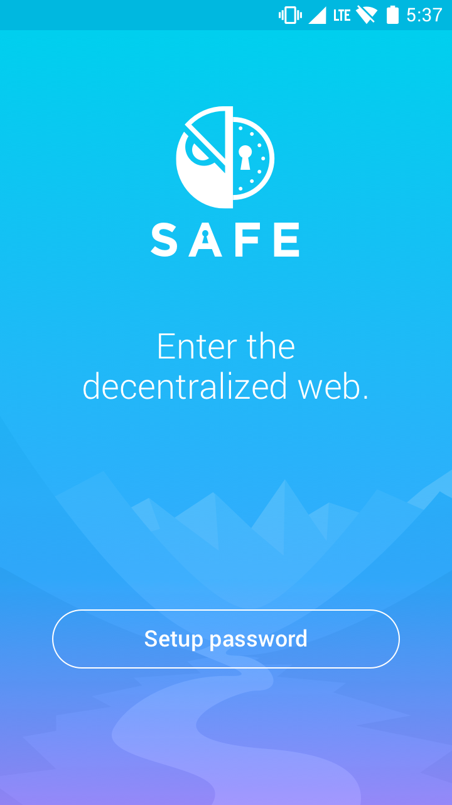
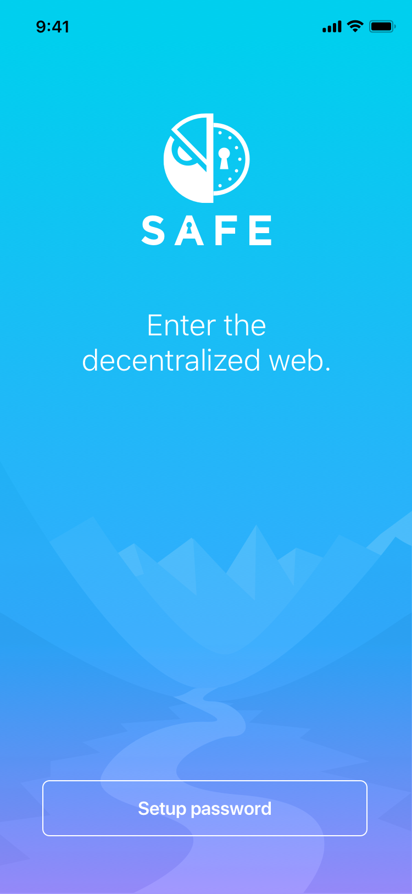

+--------+-----------------+
| issue  | title           |
+--------+-----------------+
| 86_    | Start screen    |
+--------+-----------------+

.. _86: https://github.com/gnosis/safe/issues/86

User interface
==============

.. contents:: Table of Contents

1. Start screen
---------------

Start screen when opening the app for the first time.
This screen also shows on every cold start as long as
there is no password set, yet.

